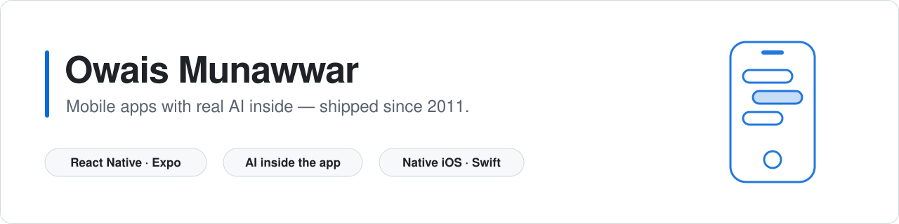

<picture>
  <source media="(prefers-color-scheme: dark)" srcset="./assets/banner-dark.svg">
  
</picture>

### React Native & iOS engineer building mobile apps with real AI inside.

14 years shipping mobile, native iOS since 2011. Seven years as an iOS subject-matter expert supporting the teams behind Fortune-500-scale apps. Independent since 2025: I build the app **and** the backend, admin panel and AI behind it.

**Top Rated on Upwork · 100% Job Success · 67 jobs · 6,700+ hours**

My last two App Store products each took **1–2 weeks to build**. App Review then takes its own time on top, and I keep those two numbers separate.

---

**📂 Open source: mobile apps you can run**

*React Native*

- **[murmur](https://github.com/OwaisMunawar/murmur)**: a private voice journal where nothing leaves the phone. On-device Whisper transcribes, a local LLM writes summaries and action items, and "Ask your notes" answers with citations, all on-device with ExecuTorch. A live Skia waveform too.
- **[expo-ai-assistant](https://github.com/OwaisMunawar/expo-ai-assistant)**: streaming multi-model AI chat for iOS, Android and web in one Expo codebase. The API key stays on a server route; a demo mode runs the full pipeline with no key.
- **[expo-smart-scan](https://github.com/OwaisMunawar/expo-smart-scan)**: an Expo native module for on-device receipt and document scanning. Swift uses Apple Vision and Foundation Models, Kotlin uses ML Kit. Model output is checked against the recognized text.
- **[rn-booking](https://github.com/OwaisMunawar/rn-booking)**: a booking product with an Expo app, a Next.js admin panel and Supabase. Row-level security per role, double-booking blocked by a Postgres exclusion constraint, and an AI concierge that books through tool calls.

*Native iOS*

- **[swiftui-live-coach](https://github.com/OwaisMunawar/swiftui-live-coach)**: native iOS 26 with SwiftData, Live Activities and Dynamic Island, interactive widgets, App Intents, HealthKit and on-device Foundation Models.

*Flutter*

- **[fixit-genui](https://github.com/OwaisMunawar/fixit-genui)**: a Flutter home-repair assistant whose answers are interactive UI, not paragraphs. Google's GenUI SDK with Gemini, a schema-validated widget catalog, safety checks that always add a pro callout for electrical and gas jobs, and offline jobs with drift.

*Also: AI agents and libraries*

- **[review-radar](https://github.com/OwaisMunawar/review-radar)**: a Python AI agent (FastAPI, PydanticAI, pgvector) with a React dashboard. It triages App Store and Google Play reviews, clusters themes, flags release regressions with real statistics, and drafts replies a person approves. Evals run in CI.
- **[durable-agent](https://github.com/OwaisMunawar/durable-agent)**: crash-safe LLM pipelines on Postgres. Leased workers, each stage committed before the next, human approval gates, an append-only audit log and an MCP server.
- **[react-native-streaming-markdown](https://github.com/OwaisMunawar/react-native-streaming-markdown)**: renders streaming LLM output without flicker. The incremental parser is about 60x faster than re-parsing on every token.

**📱 Shipped mobile**

- **[Bible Memory / ScriptureTyper](https://apps.apple.com/us/app/the-bible-memory-app/id496790833)** — live on both stores, **4.8/5 from 32K+ ratings, 100K+ Play downloads**, on a codebase dating to 2014. I led Android development in 2025 (397 commits, +101K lines): streaming speech recognition over gRPC with phrase hints and a silence cutoff to control cost, a tablet master–detail layout, features rebuilt to match iOS exactly, and a first-try scoring race condition found and fixed. On iOS I built the payments layer — StoreKit across 165 products alongside Stripe for physical goods, which Apple forbids from in-app purchase. Also adjacent-key typing for Arabic, Urdu and Hindi keyboards.

- **[Survey Collector Forms](https://apps.apple.com/us/app/survey-collector-forms/id6808237761)** — my own product, live on the App Store, built in 1–2 weeks. Offline-first survey capture for field teams: the phone owns the data. An outbox, per-table cursors and idempotent pushes mean a dropped connection never duplicates or loses a response, and a finalised response whose form was republished is raised as a conflict for a human rather than silently coerced onto the new schema. Postgres row-level security keyed to a Firebase token decides "my rows" in the database, not in a `WHERE` clause the app has to remember.

- **[POS Inventory — Shop Register](https://apps.apple.com/us/app/pos-inventory-shop-register/id6800731643)** — my own product, live on the App Store, built in 1–2 weeks. A till and stockroom for shops with unreliable internet: a sale never waits on the network. Stock is the sum of an **append-only movement ledger** rather than a mutable counter, so two devices receiving stock can't conflict; a **Lamport clock** orders edits across devices without trusting wall clocks; money is integer minor units end to end. Approved after working through four App Review rejections, each now a checklist item in my release runbook.

- **Fuel-price forecast MVP** — SwiftUI fintech demo with MVVM, dependency injection and a full design system. *"Over-delivered on every milestone."* (Upwork, 5★)

- **Secure blur & encryption SDK** — a Swift package using Metal GPU blur and AES-GCM, with decryption gated behind biometrics and the Secure Enclave. Shipped as an XCFramework with CI. (Upwork, 5★)

**🤖 AI & agents**

- **[PM Agent](https://pm-agent-black.vercel.app)** — live, and built in about a month. Turns briefs and requirements docs into a versioned spec and a backlog where a person approves every item. Each run is saved as a state machine in Postgres, so a killed worker resumes in about a second without paying for the same work twice, and runs keyed on content mean re-submitting the same documents never pays twice either. Multi-tenant, with isolation enforced by one middleware predicate rather than per-endpoint checks. 28–68 s per run at a fraction of a cent.
- **In client apps** — embedding and pgvector matching, face-liveness and ID verification, RAG with function-calling agents, voice (speech-to-text and text-to-speech), on-device Core ML.

**🧰 Full-stack behind the app**

- A bilingual (Arabic/English) two-sided marketplace: a mobile app, a Next.js admin/vendor portal, and a Supabase backend with row-level security. Escrow payments with 3-D Secure, WhatsApp webhooks, Arabic full-text search.

> 🔨 **Building in public:** these repos get regular updates. Each README has a roadmap, and the items there are what's coming next.

---

**How I build**

- **Tested on real hardware, never only a simulator.** Three bugs got past a thorough simulator run on one of my apps and appeared only on a device — a missing URL scheme, a permissions library that compiled every permission out of the build, a share sheet that threw on a zero anchor rect. Each fix was one line; the cost was the finding.
- **Every fix ships with a test that fails against the old code.** A check that passes before and after a fix is proving only that it ran.

**Stack:** React Native (Expo) · TypeScript · Swift / SwiftUI · Flutter / Dart · Next.js · Supabase / Postgres · Python / FastAPI / PydanticAI · OpenAI / Anthropic · Core ML · Stripe / RevenueCat / StoreKit

📫 **Work with me:** [Upwork](https://www.upwork.com/freelancers/owaism11) · [LinkedIn](https://www.linkedin.com/in/owais-munawwar-6236a342) · owais.munawar@gmail.com
